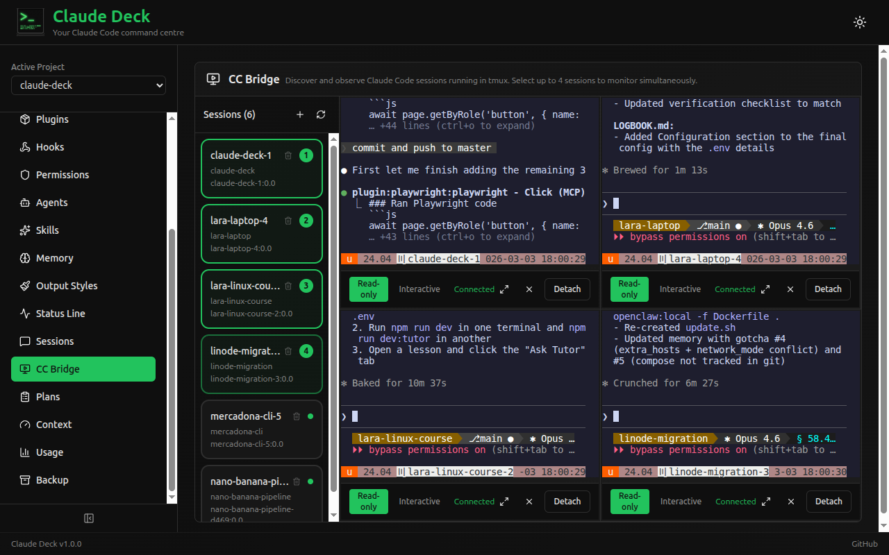
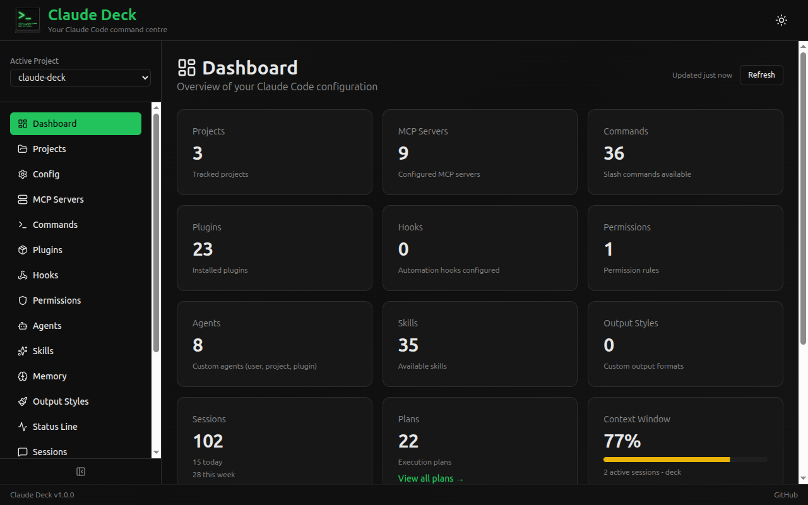
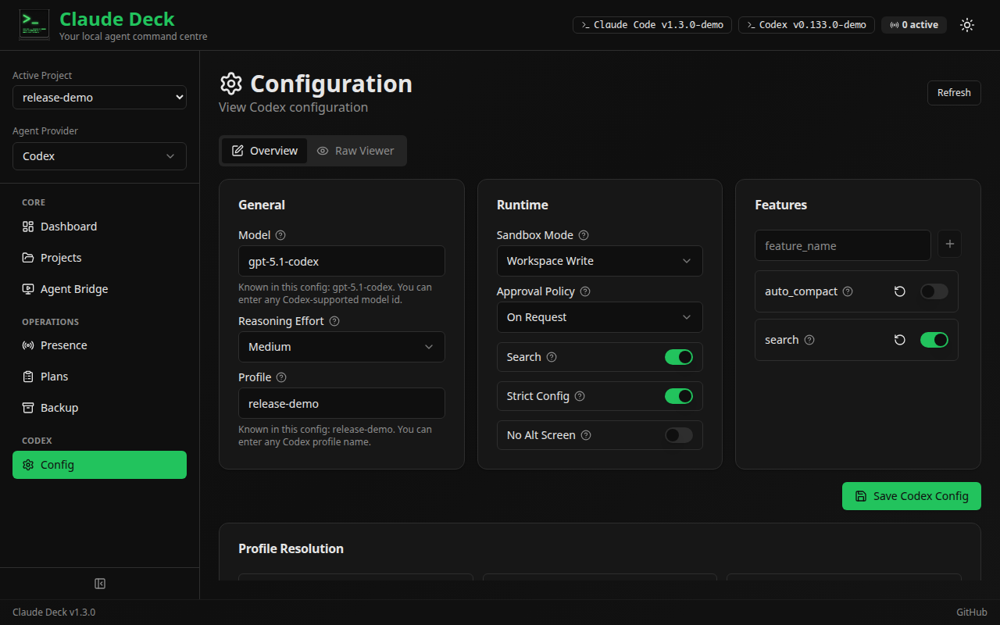
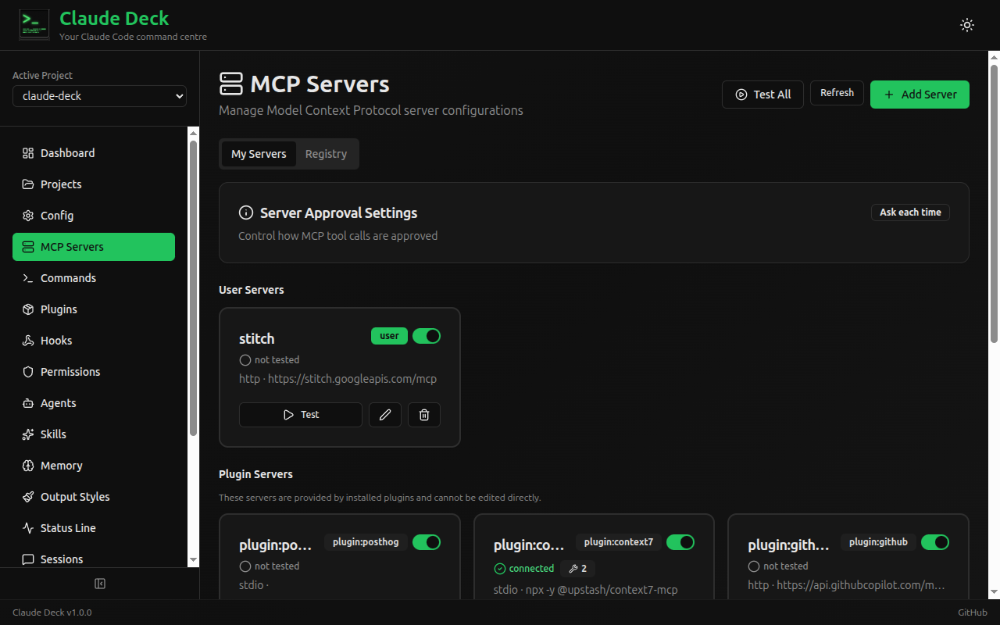
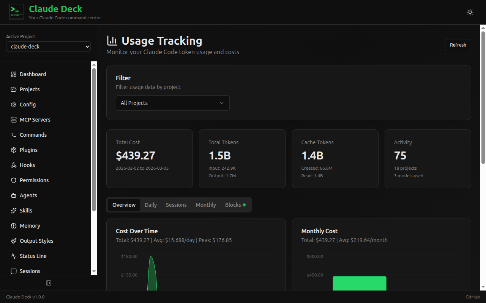
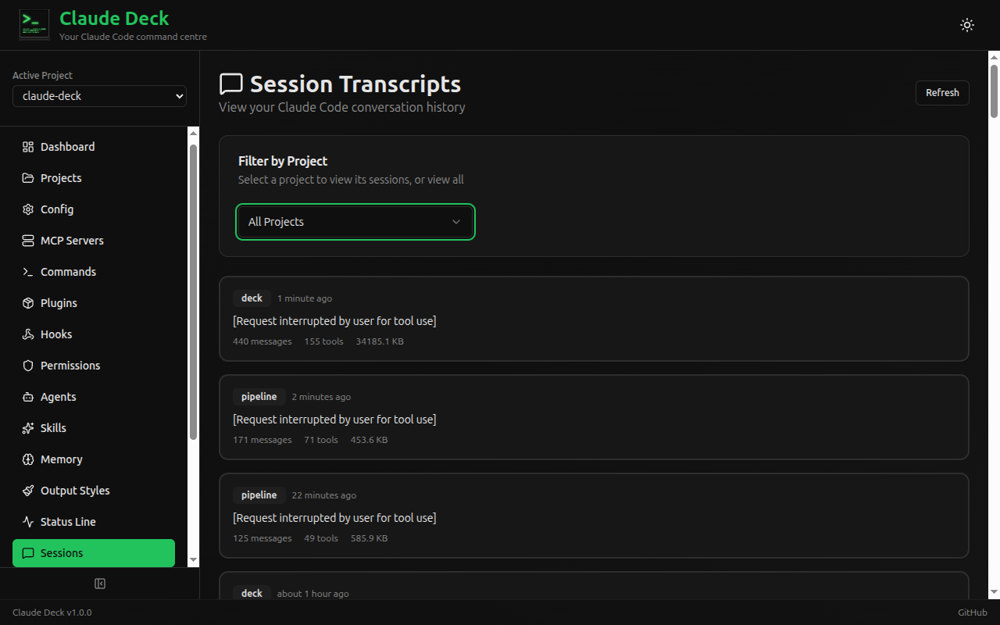
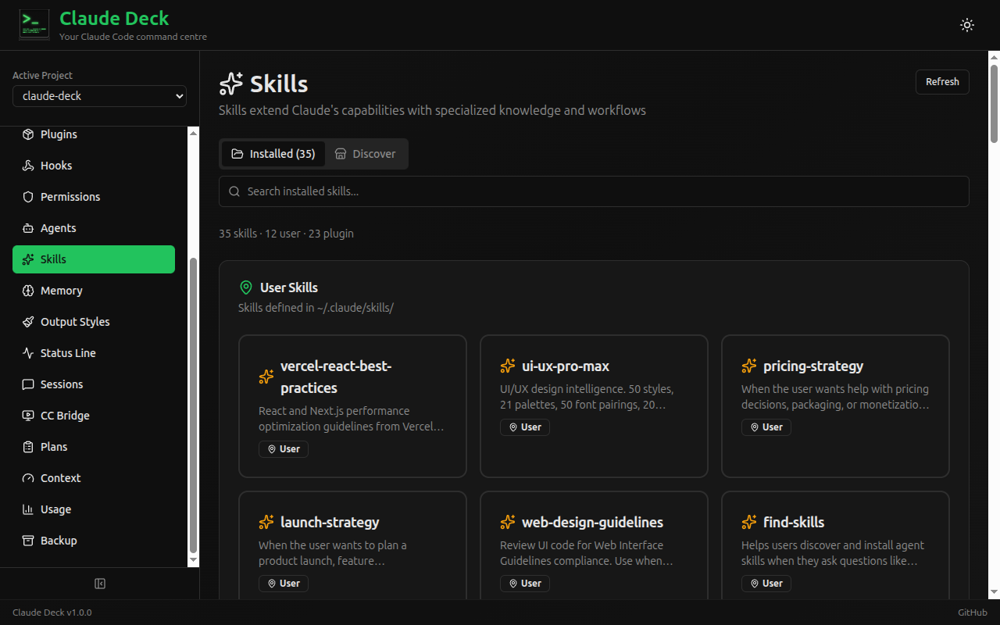

# Claude Deck

**Website**: [claudedeck.org](https://claudedeck.org)

A self-hosted web application for visualizing and managing local AI coding agents. Provides a unified interface for Claude Code configuration, Codex CLI configuration, MCP servers, plugins, slash commands, hooks, agents, permissions, usage tracking, session transcripts, Agent Bridge, and other local agent extensions.

## Why This Exists

Claude Code starts simple, then slowly sprawls across config files and directories: `~/.claude.json`, `~/.claude/settings.json`, `.mcp.json`, slash commands, agents, skills, project settings, transcripts, and usage data. That works fine at small scale, but once your setup gets serious it becomes hard to see the whole picture, change things confidently, or understand what is actually configured.

Claude Deck gives you one local interface for that sprawl. It also has provider-aware Codex CLI support for tmux sessions, safe TOML configuration, feature flags, diagnostics, MCP/plugin inventory and supported CLI-backed mutations, and redacted export-only backups.

## Best For

Claude Deck is best for people running multiple Claude Code or Codex CLI sessions, MCP servers, custom commands, hooks, agents, or tracking Claude Code usage across sessions.

If you only use Claude Code casually with mostly default config, Claude Deck may be overkill.

## Trust Model

- **Local only** — no cloud
- **No account** — nothing to sign up for
- **No telemetry** — no usage tracking sent anywhere
- **Works with your real files** — reads and writes existing Claude Code/Codex config files and agent integration files

> [!WARNING]
> Claude Deck reads and writes your real local agent configuration files. Changes made in the UI affect the files Claude Code, Codex CLI, and installed agent integrations actually use. Review changes carefully, and create a backup before major edits.

## Features

- **Dashboard** — Overview of local agent configuration with Claude Code context window visualizer
- **Provider Switcher** — Move between Claude Code, Codex CLI, and GitHub Copilot CLI surfaces without leaving the app
- **Config Editor** — Browse, inspect, and edit Claude Code JSON settings or Codex TOML settings, including Codex profiles, runtime options, and feature flags
- **MCP Servers** — Add, edit, test, and manage MCP server connections with OAuth support. Browse and install servers from the [MCP Registry](https://registry.modelcontextprotocol.io). View tools, resources, and prompts. Supports stdio, HTTP, and SSE transports
- **Slash Commands** — Browse, create, and edit custom commands (user and project scope)
- **Plugins** — Browse installed plugins with detail views and enable/disable toggles; Codex plugins support CLI-backed inventory, install, and remove where the installed Codex CLI exposes safe commands
- **Hooks** — Configure automation hooks by event type (PreToolUse, PostToolUse, etc.)
- **Permissions** — Visual allow/deny rule builder for tool access control
- **Agents** — Create and manage custom agent configurations
- **Skills** — Browse installed skills and discover new ones from [skills.sh](https://skills.sh)
- **Memory** — View and edit Claude Code memory files
- **Output Styles** — Configure response output formats
- **Status Line** — Customize Claude Code status line display
- **Agent Bridge** — Discover and monitor Claude Code, Codex CLI, and GitHub Copilot CLI sessions running in tmux. Attach up to 4 terminals simultaneously in a 2x2 grid with independent read-only/interactive modes, fullscreen toggle, and per-pane controls. Spawn new sessions and manage provider-specific options directly from the UI
- **Agent Mail** — Coordinate local Claude Code, Codex CLI, and GitHub Copilot CLI agents through durable per-repo identities, structured context requests, handoffs, and an inspectable team mailbox
- **Agent Teams** — Save reusable rosters of Claude Code, Codex, and Copilot agents, launch or reuse their sessions, and keep same-repo roles distinct through Agent Mail slot identities
- **Session Transcripts** — View conversation history with full message details and tool use
- **Usage Tracking** — Monitor token usage, costs, and billing blocks with daily/monthly charts
- **Plan History** — Browse and review Claude Code implementation plans
- **Backup & Restore** — Create and manage Claude Code backups with selective restore, plus redacted export-only Codex backups
- **Projects** — Discover and manage project directories

## What's New in 2.0.1

Claude Deck 2.0.1 is a stabilization release for the 2.x coordination work:

- Claude Code usage dashboards now calculate costs for current Claude model aliases instead of showing `$0.00` when token usage is present.
- Dashboard cards and links are provider-aware, including Codex configuration, MCP, plugin, feature flag, live session, and plan surfaces.
- Claude Code Config now exposes more current settings, including advisor model, fallback model chains, Remote Control, notification, checkpointing, theme, and safety/privacy controls.
- Plugin marketplace, worktree, and sandbox settings now write the JSON shapes expected by current Claude Code.

## What's New in 2.0.0

Claude Deck 2.0.0 shifts the product from single-agent management toward local agent coordination:

- Agent Mail gives Claude Code and Codex CLI sessions durable mail identities, structured context requests, handoffs, replies, inbox state, and one-click install flows for MCP and lifecycle hooks.
- Agent Teams adds saved rosters for repeatable project, DevOps, release, or same-repo planner/implementer teams, with launch planning and session reuse from Agent Bridge.
- External local tools such as OpenClaw can use token-bound Agent Mail endpoints to discover participants, send requests, create handoffs, poll for answers, and launch saved teams through the Agent Teams API.
- Agent Bridge now has a searchable project picker and Codex model/profile selectors when spawning sessions.
- Presence has been removed from the product. Agent Bridge, Agent Mail, and Agent Teams are now the supported observability and coordination surfaces.

Codex support remains explicit about provider boundaries: usage/context parity and session transcript browsing are not supported for Codex yet; history and model-cache diagnostics avoid prompt text and raw cache payloads; Codex automatic restore is refused because exports intentionally exclude auth, history, cache, and local state.

## Screenshots

| Agent Bridge | Dashboard |
|--------------|-----------|
|  |  |
| Monitor and interact with Claude Code, Codex, and Copilot tmux sessions | High-level overview of your local agent workspace |

| Config | MCP Servers |
|--------|-------------|
|  |  |
| Edit safe Codex TOML settings and inspect provider diagnostics | Manage MCP connections, status, and configuration |

| Usage Tracking | Session Transcripts |
|----------------|---------------------|
|  |  |
| Cost visibility, charts, and billing blocks | Browse conversation history and tool usage details |

| Skills |
|--------|
|  |
| Browse installed skills and discover new ones |

## Tech Stack

| Layer | Technology |
|-------|------------|
| Backend | Python 3.11+ with FastAPI |
| Frontend | React 19 + TypeScript 6 + Vite 7 |
| UI Components | shadcn/ui + Tailwind CSS |
| Charts | Recharts (via shadcn/ui) |
| Database | SQLite (async via SQLAlchemy + aiosqlite) |

## Installation

Claude Deck must run in the same environment where your agent CLIs and credentials are installed. Use the native install path below; Docker is not supported because containers cannot see host-installed CLIs, tmux sessions, native agent credentials, or your real repository environment.

**Prerequisites**:

- Python 3.11+
- Node.js 18+
- At least one supported local agent CLI installed on the same host: Claude Code, Codex CLI, GitHub Copilot CLI, or OpenCode CLI
- **Linux** for agent-team pane binding. Deck reads `/proc/net/tcp` and `/proc/<pid>/stat` to derive which tmux pane a registering agent is running in. On macOS or Windows every other feature works, but agents register unbound, and the Agent Mail capability-token enforcement described in `docs/deploy/pr0-capability-tokens-rollout.md` cannot be turned on

```bash
git clone https://github.com/adrirubio/claude-deck.git
cd claude-deck
./scripts/install.sh
```

> [!WARNING]
> Claude Deck is not a mock viewer. It works with your real local agent files, so changes made in the UI can change your working setup.

## Development

```bash
./scripts/dev.sh
```

This starts:
- Backend at http://localhost:8000 (API docs at http://localhost:8000/docs)
- Frontend at http://localhost:5173

To stop or restart the dev servers for this checkout:

```bash
./scripts/dev.sh stop
./scripts/dev.sh restart
```

To make the dev environment reachable from another machine on your LAN or tailnet (e.g. to monitor tmux sessions via Agent Bridge from a different host), pass `--host`:

```bash
./scripts/dev.sh --host 0.0.0.0
```

Both servers will then bind to all interfaces.

Remote use should still be native: run Claude Deck on the remote host where the agents, credentials, repositories, and tmux sessions exist, then connect from your browser over a trusted tunnel or network route.

### Naming a Claude Deck instance

When running Claude Deck on several machines, set a display name and accent color so each browser window clearly identifies the backend it controls:

```bash
CLAUDE_DECK_INSTANCE_NAME="Studio Mac" \
CLAUDE_DECK_INSTANCE_ACCENT="blue" \
./scripts/dev.sh --host 0.0.0.0
```

Supported accents are `blue`, `green`, `purple`, `orange`, `red`, `pink`, `cyan`, and `slate`. The name appears in the header, browser tab title, Agent Bridge terminal panes, and destructive confirmations.

To preview the documentation site:

```bash
./scripts/docs-dev.sh
```

This starts VitePress at http://localhost:5174/docs/. Use `--host 0.0.0.0` if you need to reach it from another machine.

For a release check, `./scripts/build.sh` builds both the app frontend and the documentation site.

## Configuration Files

Claude Deck reads and writes these Claude Code configuration files:

| File/Directory | Scope | Description |
|---------------|-------|-------------|
| `~/.claude.json` | User | OAuth, caches, MCP servers |
| `~/.claude/settings.json` | User | User settings, permissions, disabled servers |
| `~/.claude/settings.local.json` | User | Local overrides (not committed) |
| `~/.claude/commands/` | User | User slash commands |
| `~/.claude/agents/` | User | User agents |
| `~/.claude/skills/` | User | User skills |
| `~/.claude/projects/` | User | Session transcripts & usage data |
| `.claude/settings.json` | Project | Project settings |
| `.claude/commands/` | Project | Project slash commands |
| `.mcp.json` | Project | Project MCP servers |
| `CLAUDE.md` | Project | Project instructions |

Codex CLI support uses `$CODEX_HOME`, defaulting to `~/.codex`:

| File/Directory | Scope | Description |
|---------------|-------|-------------|
| `~/.codex/config.toml` | User | Main Codex TOML configuration |
| `~/.codex/*.config.toml` | User | Codex profile v2 files |
| `~/.codex/rules/` | User | Codex rule files |
| `~/.codex/auth.json` | User | Auth status only; raw contents are never returned |

## Contributing

See [CONTRIBUTING.md](CONTRIBUTING.md) for setup, style, and PR guidelines.

API documentation is available at http://localhost:8000/docs when running the dev server.

## Feedback

If you use Claude Code heavily, issues and feature requests are especially welcome.

## Built By

[Adrian](https://github.com/adrirubio) (13) and [Juan](https://github.com/juanrubio) during the 2025 Christmas break as a learning project — to explore open source, Claude Code, and full-stack development together.

## Acknowledgments

The session transcript viewer was inspired by and includes code adapted from [claude-code-transcripts](https://github.com/simonw/claude-code-transcripts) by [Simon Willison](https://simonwillison.net/).

The usage tracking feature ports algorithms from [ccusage](https://github.com/ryoppippi/ccusage) by [ryoppippi](https://github.com/ryoppippi), including session block identification, tiered pricing, and burn rate projections.

## Disclaimer

Claude Deck is a community project and is not affiliated with or endorsed by Anthropic.

## License

MIT License
