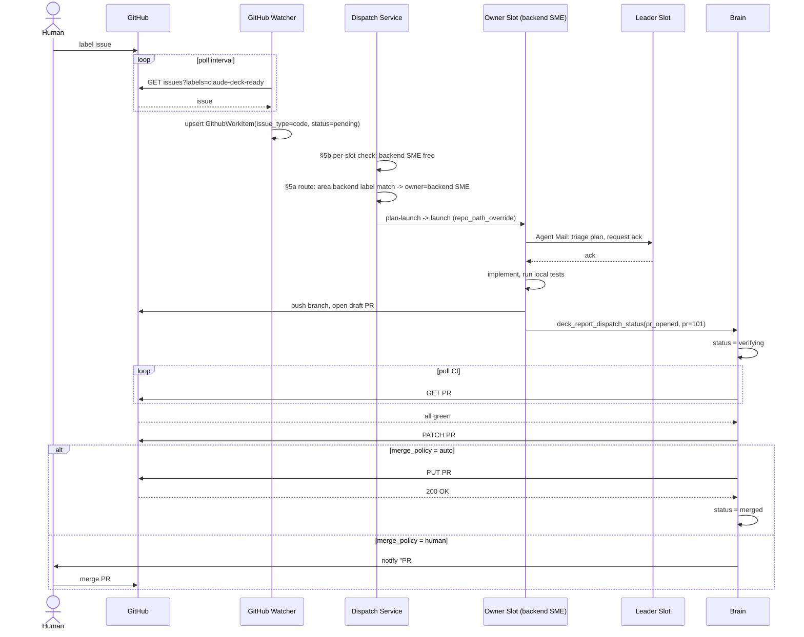
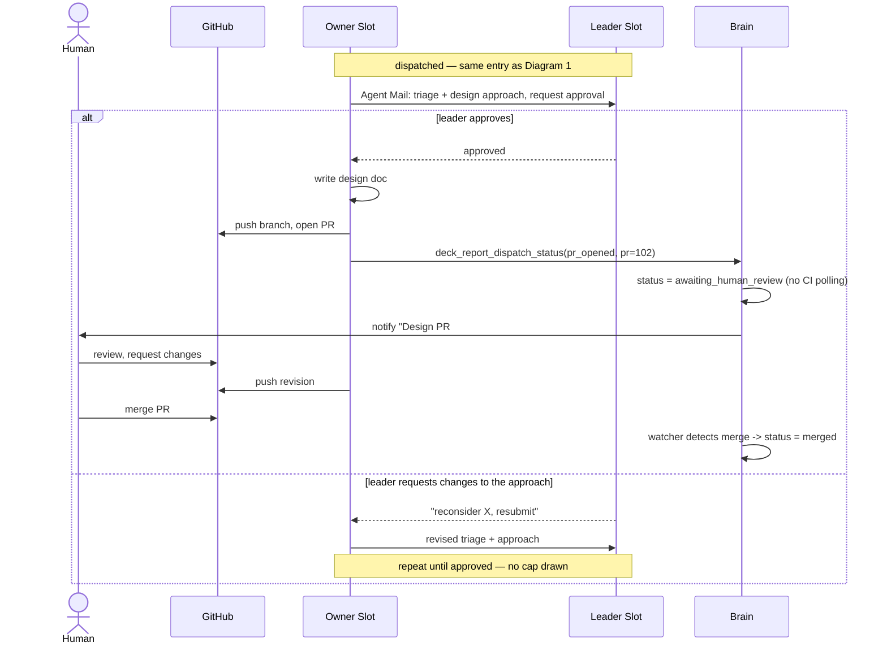
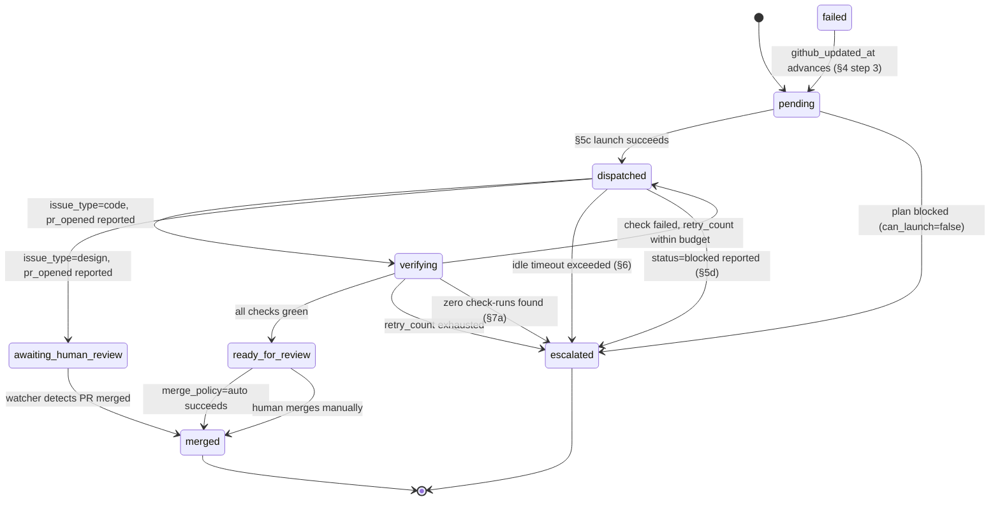
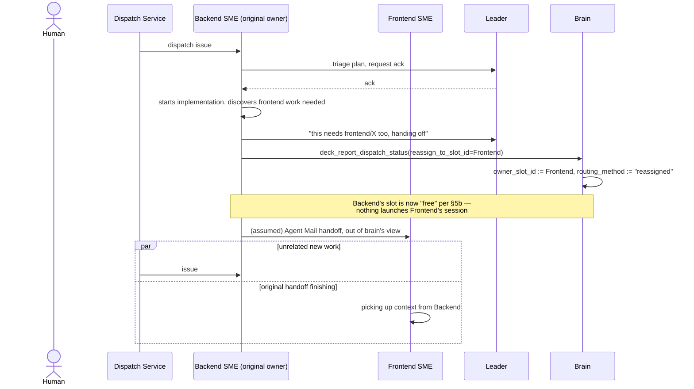
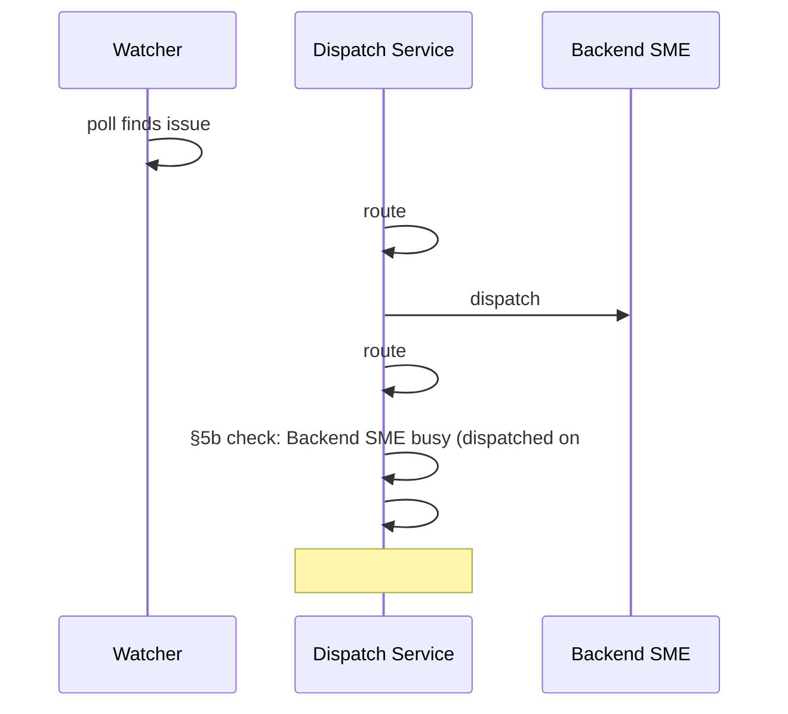
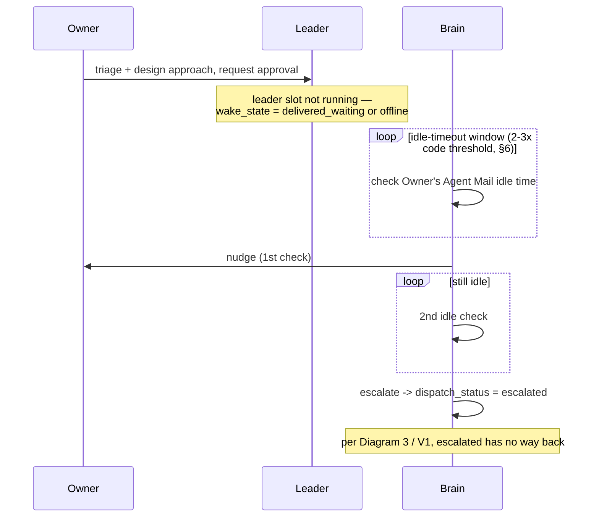

# Autonomous GitHub Dispatch — Workflow Diagrams & Pressure Test

**Companion to:** `2026-07-02-autonomous-github-dispatch-design.md`
**Purpose:** Render the spec's key workflows as diagrams and use them to find gaps that don't surface when reading section-by-section prose. Findings are numbered `V1..V8` (V = "visual") to keep them distinct from the prior pressure-test's `B/C/D` findings, which are already fixed in the spec this document reviews.

Each diagram is followed by what looking at it — specifically, following every arrow to its destination and asking "who's watching this edge, and for how long" — surfaced.

---

## 1. Code-issue happy path (defect / feature)

**Following the arrows surfaced:**

- **V2 — the `PUT .../merge` arrow has no failure branch.** The diagram draws one clean arrow into `merged`. But that call can return 409 (branch out of date, required review not satisfied, branch protection rule) just as easily as 200. The spec (§7a) states the success path only. There's no defined behavior for a *failed* auto-merge attempt — no retry, no escalation, no notification. As drawn, a failed merge call has nowhere to go, which means in practice it would silently strand the item at `ready_for_review` with `merge_policy=auto` unable to ever actually merge it, and no signal to a human that anything is wrong (they'd have to happen to check GitHub and wonder why an "auto-merge" repo has a stale green PR sitting open).

---

## 2. Design-issue happy path

**Following the arrows surfaced:**

- **V3 — the "repeat until approved" loop has no visible exit condition or budget.** Drawing this branch forced the question the prose glossed over: §5c describes the leader as a real reviewer for design issues ("this IS the approval gate"), which means "leader requests changes" is a legitimate, expected outcome — not an edge case. But `retry_count` (§8) is explicitly scoped to §7a's CI-failure retries. There is no counter anywhere on the *pre-dispatch* approval loop, for either issue type, and it's mechanically invisible to the brain besides — the owner and leader are actively messaging each other, so idle-timeout (§6) never fires. An owner/leader pair that disagrees indefinitely (or just drifts into a long unstructured design conversation) occupies the owner's per-slot cap (§8, hard limit 1) with no forcing function to end it.
- **V7 (sharpened by this diagram) — the design-specific generous idle-timeout (§6) protects exactly this unbounded loop, not just healthy slow review.** The multiplier that stops the brain from falsely flagging "still reviewing" as "stuck" is the same multiplier that makes V3's failure mode take longer to detect.

---

## 3. `GithubWorkItem.dispatch_status` state machine

**Following the states surfaced:**

- **V1 — `escalated` has no outgoing edge.** Drawing the state machine makes this unmissable in a way the prose didn't: every other non-terminal state has at least one path forward (even `failed`, via the watcher's reset-on-update rule in §4 step 3). `escalated` has none. §4's reset logic explicitly resets `failed → pending`, not `escalated → pending`. §10 makes the activity feed read-only — no manual retry/reroute action exists in the UI. So the only two states this diagram can legitimately call "terminal" are `merged` and `escalated`, but `merged` is terminal *because the work is done*, while `escalated` is terminal *because the design forgot to give it a way out*. A human's only recourse today, per the spec as written, is something entirely outside the modeled system — e.g. closing the GitHub issue and opening a fresh one, discarding all routing/reassignment history.
- Where does `failed` actually get *entered from*? Tracing backward: nothing in the transition list writes `failed` — §4 step 3 only *reads* it (to reset it to `pending`). The status enum in §3.2 lists `failed` as a valid value, but no section of the dispatch/verify logic ever sets it. It's a state the schema supports and the watcher knows how to recover from, but nothing in the current design produces it. Either this is dead code in the schema, or there's an intended producer (e.g. "the owner's session itself failed/crashed mid-implementation, distinct from a CI check failing") that the spec never wrote down.

---

## 4. Cross-area feature with mid-task reassignment (Scenario B)

**Following the arrows surfaced:**

- **V4 — nothing in the diagram launches Frontend's session.** The brain's only action on reassignment is a database write (`owner_slot_id`, `routing_method`). Whether Frontend SME's slot is actually running, and whether it actually receives and acts on Backend's handoff message, is entirely outside anything the brain does, checks, or confirms. If Frontend SME's slot isn't currently launched, the handoff message is stored per Agent Mail's existing `delivered_waiting` semantics — but nothing re-dispatches or wakes it beyond what Agent Mail already does for any recipient. The reassignment *looks* like a completed action from the brain's state (`owner_slot_id` updated) even when the real-world handoff hasn't actually landed anywhere yet.
- **V5 — the `par` block is the actual bug the diagram catches that prose missed.** The instant `owner_slot_id` updates to Frontend, Backend's slot reads as free to §5b's per-slot check. Diagram 4 draws this explicitly as two things happening "in parallel": a brand new issue #90 can dispatch into Backend's slot at the exact moment Backend is still mid-conversation handing #77 off to Frontend. There's no grace period, no "handoff pending" sub-state, nothing that keeps Backend's slot reserved until the handoff is *confirmed* landed (which, per V4, the brain can't even confirm in the first place).

---

## 5. Two same-area issues land in one poll cycle (concurrency queueing)

**Following the arrows surfaced:**

- **V6 — the diagram's own note is the finding.** There is exactly one visual state (`pending`) for two operationally distinct situations: "just discovered, about to be routed" and "routed, but queued because its SME is busy." §10's activity feed shows `dispatch_status` and `routing_method`, but `routing_method` is only populated once routing actually happens (§5a) — and per-slot queuing happens *after* routing (§5b runs after §5a resolves `owner_slot_id`). So a human watching the dashboard would actually see #51 with `owner_slot_id` already set to Backend SME and `dispatch_status="pending"` — which reads as "why hasn't this been picked up" with no visible explanation that the answer is "your backend person is already on it."

---

## 6. Leader never comes online (design issue)

**Following the arrows surfaced:**

- **V7 (restated concretely) — the generous design threshold is indifferent to *why* the owner is idle**, and this diagram is the case where that indifference actively costs the most: an offline leader (not a slow-reviewing one) is stuck behind the *same* multiplier meant to protect legitimately slow review, and design-approval requests are a plausible candidate for "the thing a busy leader looks at last." The item then lands in `escalated` (V1) with no recovery path, having taken 2-3x longer than a code issue to get there.

---

## Consolidated Findings (V1–V8)

| # | Severity | Finding | Where it surfaced |
|---|---|---|---|
| V1 | **High** | `escalated` has no outgoing transition anywhere in the spec — no watcher reset rule (§4 only resets `failed`), no UI action (§10 is read-only). Once an item escalates, there's no defined path back into the pipeline. | Diagram 3 |
| V2 | **Medium-High** | Auto-merge (`PUT .../merge`) has no defined failure path — a 409 (branch protection, stale branch, unmet review requirement) leaves the item silently stranded at `ready_for_review` with no retry, escalation, or notification. | Diagram 1 |
| V3 | **Medium** | The pre-dispatch triage/approval exchange between owner and leader has no round cap or timeout distinct from idle-detection — an owner/leader pair that iterates (especially plausible for design review, per §5c/§6's own framing) occupies the per-slot cap indefinitely without tripping any guardrail, since active messaging never reads as "idle." | Diagram 2 |
| V4 | **Medium** | Reassignment (`reassign_to_slot_id`) is a bookkeeping-only update — the brain never confirms the new owner slot is running or has actually received/accepted the handoff. The state can say "reassigned" while nothing real has happened yet. | Diagram 4 |
| V5 | **Medium** | The moment `owner_slot_id` changes on reassignment, the *original* owner's slot reads as free to §5b's per-slot concurrency check — with no grace period for the handoff to actually complete, a new item can dispatch into that slot while the original owner is still mid-handoff. | Diagram 4 |
| V6 | **Low-Medium** | The activity feed (§10) can't distinguish "freshly discovered, about to route" from "routed but queued behind a busy slot" — both show as `dispatch_status="pending"`, which is precisely where an operator most needs to tell the two apart. | Diagram 5 |
| V7 | **Low-Medium** | The generous idle-timeout multiplier for design issues (added specifically to avoid punishing legitimate slow review, §6) is indifferent to cause — it protects a genuinely offline/unresponsive leader exactly as long as it protects a healthy slow reviewer, and design-approval requests seem more likely than code-plan acks to be the thing a busy leader defers. | Diagrams 2, 6 |
| V8 | **Low** | Monitoring (§6) only reads Agent Mail idle-time, never checking whether the underlying tmux session/process is actually still alive. A crashed session is indistinguishable from an idle one and detected on the same timeline — probably acceptable, but the spec never says this is an accepted tradeoff versus an oversight. | Diagram 1 (implicit) |
| — | **Note, not a defect** | `failed` is a valid `dispatch_status` value with a defined recovery rule (§4 step 3) but no code path anywhere in the spec ever *sets* it. Either it's meant for "the owner's session itself errored/crashed" (never written down) or it's a vestige that should be removed. | Diagram 3 |

V1 and V2 are the ones I'd fix before writing an implementation plan — both are missing edges in a state machine that's otherwise fully connected, and both are the kind of gap that only costs something the day it actually happens (a design escalates, or a merge 409s) rather than showing up in a quick read-through.
