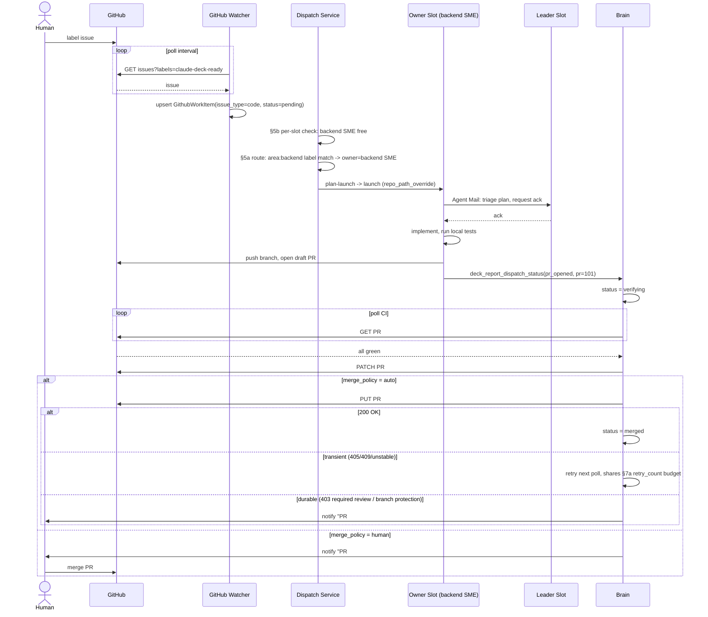
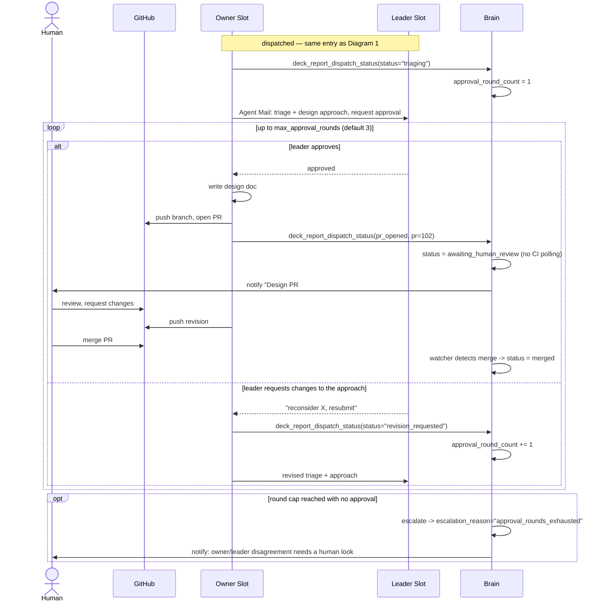
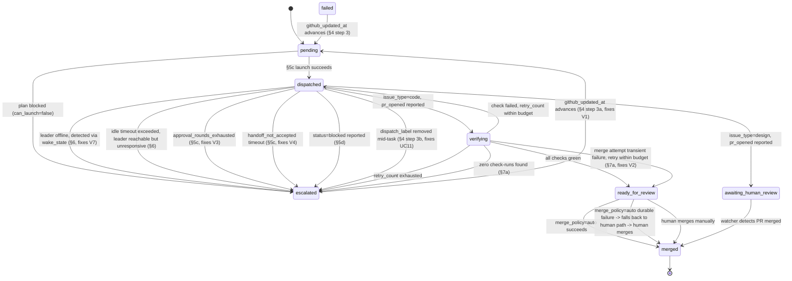
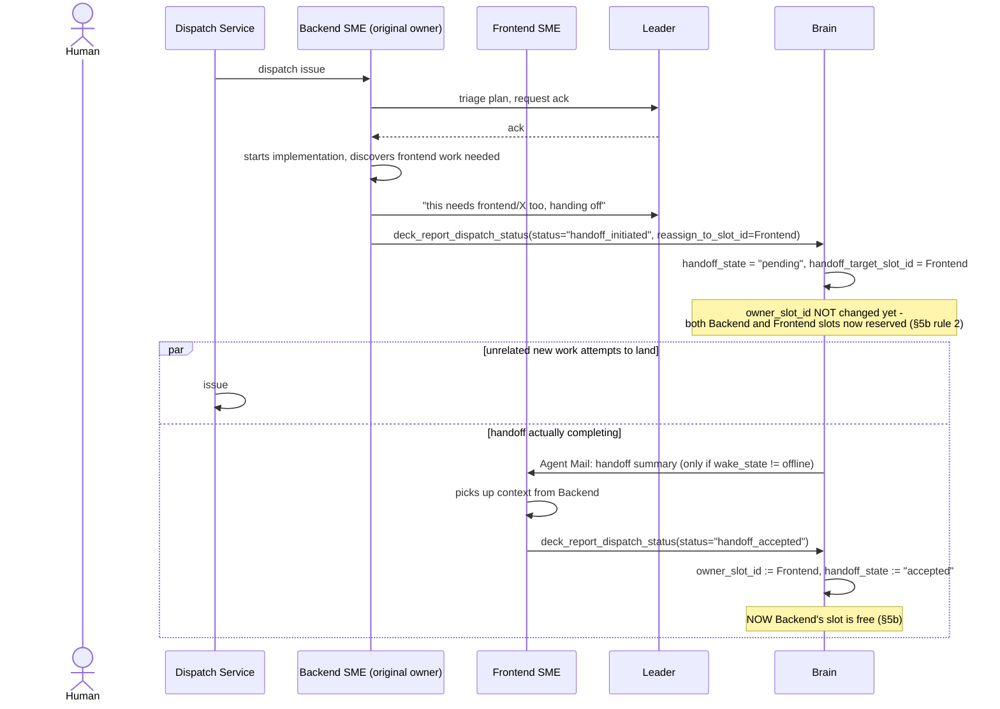
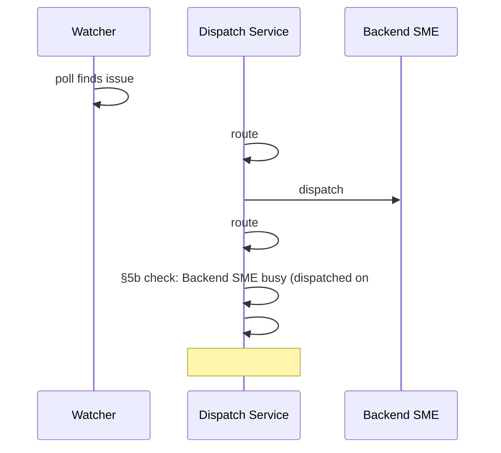
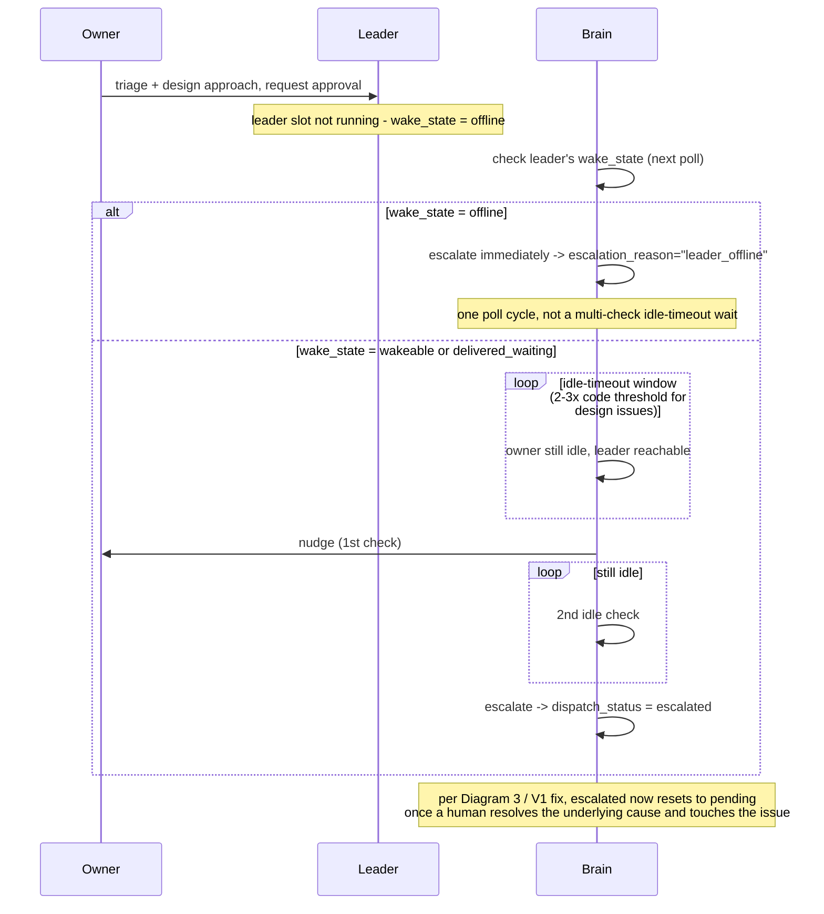

# Autonomous GitHub Dispatch — Workflow Diagrams & Pressure Test

**Companion to:** `2026-07-02-autonomous-github-dispatch-design.md`
**Status:** Revised — diagrams below reflect the fixes applied for findings V1–V7 and UC11 (see the design spec's "Findings addressed in this revision (round 2)" table). The original as-found diagrams and reasoning are preserved inline as **"Before this fix"** callouts so the trail from finding to fix stays visible; the diagrams themselves now draw the *fixed* behavior.
**Purpose:** Render the spec's key workflows as diagrams and use them to find gaps that don't surface when reading section-by-section prose. Findings are numbered `V1..V8` (V = "visual") to keep them distinct from the prior pressure-test's `B/C/D` findings.

Each diagram is followed by what looking at it — specifically, following every arrow to its destination and asking "who's watching this edge, and for how long" — surfaced, and (where applicable) how the current diagram reflects the fix.

---

## 1. Code-issue happy path (defect / feature), now with the merge-failure branch

**V2 — fixed.** The `PUT .../merge` arrow now has three branches instead of one. A transient failure (branch temporarily unmergeable) retries against the same budget §7a already uses for CI-failure retries — no new counter, no separate guardrail to configure. A durable failure (branch protection, unmet required review) doesn't retry at all: it falls back to exactly the notification path `merge_policy="human"` already defines, since the repo's own rules are correctly requiring a human — that's not a pipeline failure worth an `escalation_reason`, just a normal outcome for a protected branch.

**Before this fix:** the diagram drew one arrow, `PUT PR #101 merge → 200 OK → merged`, with nothing else. A 409 had nowhere to go — the item silently stranded at `ready_for_review` forever, with no retry, no escalation, no notification, and `merge_policy="auto"` quietly unable to ever finish the job it was configured to do.

---

## 2. Design-issue happy path, now with the approval-round cap

**V3 — fixed.** Every triage message and every revision now increments `approval_round_count` via an explicit tool call (`deck_report_dispatch_status`), not something the brain infers from message content. Once the count reaches the scope's `max_approval_rounds` (default 3) without an approval, the brain escalates instead of letting the loop run forever — and because escalation now (per the V1 fix) has a real recovery path, this isn't a dead end either: a human resolves the disagreement, touches the issue, and the item re-enters at `pending`.

**V7 (partially addressed here too).** The design-specific generous idle-timeout multiplier still exists for genuinely slow *review* (§6), but it's no longer the only thing standing between a stuck approval loop and forward progress — the round cap bounds the loop by round count, independent of how long each round takes. See Diagram 6 for the sharper fix (leader-liveness detection), which addresses the *other* half of V7 — an offline leader, as opposed to a slow-but-present one.

**Before this fix:** the "repeat until approved" branch had no exit condition drawn at all — an owner/leader pair that disagreed indefinitely occupied the owner's per-slot cap forever, invisible to idle-detection because active messaging never reads as idle.

---

## 3. `GithubWorkItem.dispatch_status` state machine, now with a way out of `escalated`

**V1 — fixed.** `escalated` now has an outgoing edge, drawn explicitly: `escalated --> pending`, triggered by the same `github_updated_at`-advances signal that already recovers `failed` items. A human resolves whatever caused the escalation (visible via `escalation_reason` in the activity feed), touches the issue (a comment is enough), and the watcher's next poll resets it. `escalated` is no longer the only state in the diagram with no way forward — and notably, it's also no longer drawn as a second "terminal" state alongside `merged`: the diagram only has one true terminal box now.

Also visible in this revision: the `escalated`-entry edges have multiplied (offline-leader, round-exhaustion, handoff-timeout, label-removal) — this is a direct, visual consequence of giving `escalated` a recovery path. In the previous revision, adding a new escalation trigger meant adding a new dead end; now it just means adding one more edge into a state that already knows how to recover. That's the structural payoff of fixing V1 first.

**Still true, unresolved by this revision:** where does `failed` get entered *from*? Tracing the transition list, nothing in the current design ever sets `dispatch_status="failed"` — the schema and the recovery rule both exist, but no producer does. This is flagged in the design spec as an open item worth resolving (either name the intended producer — e.g. "the owner's session crashed" — or remove the unused state), not fixed in this revision, since it's a documentation gap rather than a behavioral one.

**Before this fix:** `escalated` had no outgoing transition anywhere — no watcher reset rule, no UI action. It was the only true dead end in the machine.

---

## 4. Cross-area feature with mid-task reassignment, now a two-phase handoff

**V4 / V5 — fixed.** Reassignment is now visibly two messages, not one: `handoff_initiated` (Backend) and `handoff_accepted` (Frontend), with a real intermediate state (`handoff_state="pending"`) between them. The `par` block that previously showed the bug now shows the fix working: issue #90's attempt to dispatch into Backend's slot is checked against §5b rule 2 (which now also reserves the *target* slot of a pending handoff, not just the original owner's) and correctly stays `pending` — no race, because the busy-check now looks at `handoff_state`, not just `owner_slot_id`.

If Frontend never calls `handoff_accepted` (offline, or alive but unresponsive), a timeout fallback (not drawn here for clarity — see Diagram 6's structurally identical pattern) escalates the item with `escalation_reason="handoff_not_accepted"` rather than leaving it silently in limbo.

**Before this fix:** the diagram showed exactly one write (`owner_slot_id := Frontend`) with a note reading *"Backend's slot is now 'free' per §5b — nothing launches Frontend's session"* directly beside a `par` block where a brand-new issue dispatched into Backend's slot at the same moment Backend was still mid-handoff. The reassignment looked complete the instant it was requested, regardless of whether Frontend had done anything at all.

---

## 5. Two same-area issues land in one poll cycle, now with a visible reason for the wait

**V6 — fixed.** The one-line note at the bottom is the whole fix: `pending_reason` is now a real column, set the moment §5b's busy-check queues an item rather than dispatching it, and cleared back to `null` the moment dispatch actually proceeds. A human looking at the activity feed sees "pending · queued behind Backend SME," not a bare "pending" indistinguishable from an item nobody has looked at yet.

**Before this fix:** both situations — "just discovered" and "routed but queued because its SME is busy" — rendered as the identical `dispatch_status="pending"`, with `owner_slot_id` already populated in the queued case but nothing in the UI surfacing that difference.

---

## 6. Leader never comes online (design issue), now detected via `wake_state`

**V7 — fixed.** The branch on `wake_state` is the fix: an *actually offline* leader is now detected and escalated in the very next poll cycle — no waiting out the generous 2-3x design-issue multiplier first, because "offline" is a fact Agent Mail already exposes directly, not something that has to be inferred from how long the owner's been quiet. The generous multiplier still exists, but it's now scoped correctly — it only governs the genuinely ambiguous case (leader is reachable, might be reviewing carefully or might be neglecting the inbox), which is the case it was actually designed to protect.

**Before this fix:** both causes of owner-idle — leader offline vs. leader legitimately slow-reviewing — funneled into the same generous timeout, so an offline leader took just as long to detect as a healthy slow reviewer, which was backwards: the case that most needs fast detection (nothing is happening and nothing will) got the *most* patience, not the least.

---

## Consolidated Findings (V1–V8) — status after this revision

| # | Severity | Finding | Status | Fix |
|---|---|---|---|---|
| V1 | High | `escalated` had no outgoing transition — no watcher reset, no UI action. | **Fixed** | Watcher reset rule (§4 step 3a) mirrors `failed`; narrow "Retry" UI action (§10). |
| V2 | Medium-High | Auto-merge had no failure branch — a 409 stranded the item silently. | **Fixed** | Transient failures retry against the shared budget; durable failures fall back to the human-review path (§7a). |
| V3 | Medium | Pre-dispatch triage/approval loop had no round cap distinct from idle-detection. | **Fixed** | New `max_approval_rounds` guardrail (§3.1, §8), enforced via explicit `deck_report_dispatch_status` calls (§5c/§5d). |
| V4 | Medium | Reassignment was bookkeeping-only — never confirmed the new owner accepted. | **Fixed** | Two-phase handoff protocol: `handoff_initiated` → `handoff_accepted`, with a timeout fallback to `escalated` (§5c). |
| V5 | Medium | Old owner's slot read as free the instant reassignment happened, no grace period. | **Fixed** | Per-slot busy-check now also reserves the slot during `handoff_state="pending"` (§5b rule 2). |
| V6 | Low-Medium | "Freshly discovered" and "queued behind a busy slot" were visually identical (`pending`). | **Fixed** | New `pending_reason` column, surfaced distinctly in the activity feed (§3.2, §10). |
| V7 | Low-Medium | Generous design-issue idle threshold couldn't distinguish an offline leader from a legitimately slow one. | **Fixed** | Monitoring now checks Agent Mail `wake_state` first; offline escalates in one poll cycle instead of waiting out the multiplier (§6). |
| V8 | Low | Monitoring only reads Agent Mail idle-time/wake_state, never checking the underlying tmux session/process directly. | **Accepted tradeoff, not fixed** | The design spec's §11.12 explicitly notes this inherits whatever staleness Agent Mail's own observation pass has — the same tolerance every other Agent Mail consumer already accepts, not a new risk this design introduces. Not worth a second, redundant liveness mechanism. |
| — | Note | `failed` has a defined recovery rule but no transition in the spec ever produces it. | **Still open** | Flagged, not fixed — either name the intended producer or remove the state. Documentation gap, not a behavioral one. |

The design spec also picked up one fix from a companion use-case walkthrough that wasn't part of the original diagram set: **UC11** (removing `dispatch_label` from an in-flight issue had no effect) is now handled by an active-item label recheck (§4 step 3b) that escalates with a "notify, don't kill" message to the owner — deliberately not a forced session kill, since Claude Deck has no safe way to terminate a mid-task agent process without risking a half-written commit.
